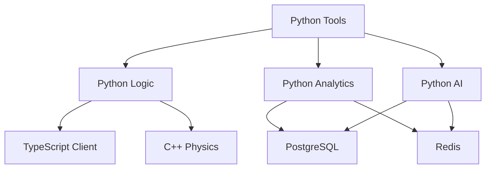

# Архитектура проекта Tetris

## Обзор

Проект Tetris представляет собой современную реализацию классической игры с элементами Tricky Towers, построенную на микросервисной архитектуре. Система состоит из следующих основных компонентов:

1. Python Game Server - основной сервер игры
2. Python Analytics - система аналитики и мониторинга
3. Python AI - система искусственного интеллекта
4. TypeScript Client - клиентская часть
5. C++ Physics Engine - физический движок
6. Python Tools - инструменты разработки

## Компоненты системы

### Python Tools
- Редактор уровней
- Генератор уровней
- Анализатор игровых данных
- Профилировщик производительности
- API для интеграции с другими компонентами

### Python Logic
- Игровая логика
- Управление состоянием
- Обработка событий
- Валидация данных

### Python Analytics
- Сбор метрик
- Анализ данных
- Генерация отчетов
- Визуализация

### Python AI
- ИИ для генерации уровней
- ИИ для анализа игровых данных
- ИИ для оптимизации производительности

### TypeScript Client
- Пользовательский интерфейс
- Обработка ввода
- Рендеринг
- Сетевое взаимодействие

### C++ Physics
- Физический движок
- Коллизии
- Симуляция
- Оптимизация

## Взаимодействие компонентов

## Потоки данных

1. Редактор уровней -> Python Logic
2. Генератор уровней -> Python Logic
3. Python Logic -> TypeScript Client
4. Python Logic -> C++ Physics
5. TypeScript Client -> Python Analytics
6. Python Analytics -> PostgreSQL
7. Python Analytics -> Redis
8. Python AI -> Python Logic
9. Python AI -> Python Analytics

## API Endpoints

### Python Tools API
- `GET /status` - Статус API
- `POST /levels` - Создание уровня
- `GET /levels` - Список уровней
- `GET /levels/{level_name}` - Данные уровня
- `POST /sessions` - Создание сессии
- `GET /sessions` - Список сессий
- `GET /sessions/{session_id}` - Данные сессии
- `POST /analytics` - Загрузка аналитики

## База данных

### PostgreSQL
- Уровни
- Сессии
- Аналитика
- Отчеты

### Redis
- Кэш
- Очереди
- Временные данные
- Состояние

## Логирование

### Уровни логирования
- DEBUG
- INFO
- WARNING
- ERROR
- CRITICAL

### Форматы логов
- JSON
- Text
- Structured

### Направления логов
- File
- Console
- Network
- Database

## Безопасность

### Аутентификация

- JWT токены
- OAuth 2.0
- Двухфакторная аутентификация
- Сессии
- API ключи

### Авторизация

- RBAC (Role-Based Access Control)
- ACL (Access Control Lists)
- Политики безопасности
- Аудит
- Мониторинг

### Шифрование

- TLS/SSL
- Асимметричное шифрование
- Симметричное шифрование
- Хеширование
- Цифровые подписи

## Масштабирование

### Горизонтальное масштабирование

- Балансировка нагрузки
- Репликация данных
- Шардирование
- Кэширование
- Очереди сообщений

### Вертикальное масштабирование

- Оптимизация ресурсов
- Мониторинг производительности
- Профилирование
- Тюнинг
- Автоматическое масштабирование

## Мониторинг

### Метрики

- Prometheus
- Grafana
- StatsD
- ELK Stack
- Jaeger

### Логирование

- Structured logging
- Log aggregation
- Log analysis
- Log retention
- Log rotation

### Трейсинг

- Distributed tracing
- Performance profiling
- Error tracking
- User monitoring
- Business metrics

## Развертывание

### Docker

- Контейнеризация
- Docker Compose
- Docker Swarm
- Kubernetes
- CI/CD

### Облако

- AWS
- GCP
- Azure
- DigitalOcean
- Heroku

## Разработка

### Тестирование

- Unit tests
- Integration tests
- End-to-end tests
- Performance tests
- Security tests

### Документация

- API documentation
- Architecture documentation
- Development guides
- Deployment guides
- User guides

### CI/CD

- GitHub Actions
- Jenkins
- GitLab CI
- CircleCI
- Travis CI
